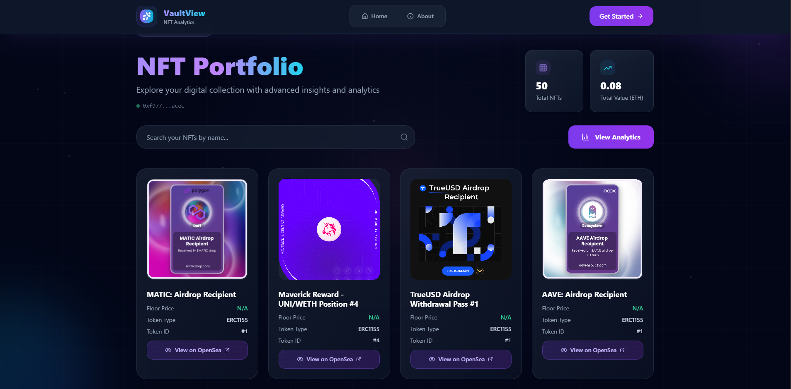
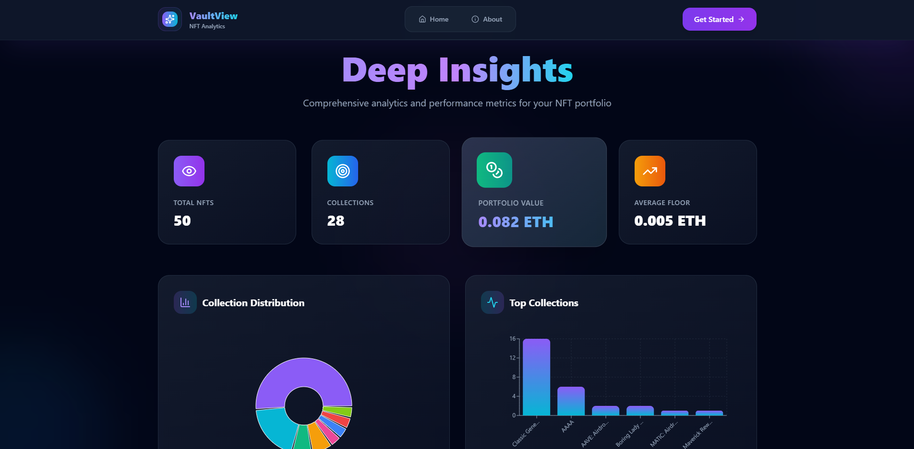

## **VaultView – NFT Portfolio Tracker**

VaultView is a modern, responsive NFT portfolio tracker built with **React, Vite, Tailwind CSS, and Alchemy NFT APIs**.
It lets users enter an Ethereum wallet address to instantly view owned NFTs, analytics, and more — with a gallery‑first design, dark mode, and newsletter integration.

---

### **✨ Features**

* **NFT Portfolio View**

  * Paste any Ethereum wallet address and view owned NFTs instantly.
  * Beautiful responsive gallery layout with image fallbacks and skeleton loaders.
  * Search NFTs by name.

* **Analytics Dashboard**

  * Total NFTs, unique collections, highest floor price, average floor price.
  * Pie chart of collection distribution using **Recharts**.

* **Floor Price Support**

  * Fetches floor price from **Alchemy NFT API**.
  * Skips empty or zero‑value floor prices gracefully.

* **Sleek UI**

  * Sleek UI with smooth Tailwind transitions.

* **Newsletter / EmailJS Integration**

  * Subscribe form sends a welcome email using **EmailJS**.
  * Contact form sends user inquiries directly without backend.

---

### **🖼 Demo Pages**

1. **Home** – Hero section, features, how it works, call‑to‑action.
2. **Portfolio** – NFT gallery view for a wallet.
3. **Analytics** – Stats and chart view for a wallet.
5. **About** – Mission, FAQ (expandable/collapsible).
6. **Demo** – Preloaded wallet to showcase features.

---

### **🚀 Tech Stack**

* **Frontend**: React + Vite
* **Styling**: Tailwind CSS + Dark mode
* **State Management**: React Hooks
* **Charts**: Recharts
* **Skeleton Loading**: react-loading-skeleton
* **Email**: EmailJS (no backend required)
* **NFT API**: [Alchemy NFT API](https://docs.alchemy.com/reference/nft-api-quickstart)

---

### **🔑 Environment Variables**

Create a `.env` file in the root:

```bash
VITE_ALCHEMY_KEY=your_alchemy_api_key
VITE_EMAILJS_SERVICE_ID=your_emailjs_service_id
VITE_EMAILJS_TEMPLATE_ID=your_emailjs_template_id
VITE_EMAILJS_PUBLIC_KEY=your_emailjs_public_key
```

> ⚠️ Restart your dev server after adding `.env`.

---

### **📦 Installation & Setup**

1. **Clone the repo:**

   ```bash
   git clone https://github.com/Dev-Rodiyat/VaultView.git
   cd VaultView
   ```

2. **Install dependencies:**

   ```bash
   npm install
   ```

3. **Run locally:**

   ```bash
   npm run dev
   ```

4. **Build for production:**

   ```bash
   npm run build
   ```

---

### **🧩 Usage**

* Visit **Home** and paste any Ethereum wallet address (e.g.,
  `0x8e3bC207b7E5a2cf5e71480714C72a7bA2e3dEa0`) to view NFTs.
* Use the **Demo Wallet** button for sample data.
* Navigate to **Analytics** for collection stats and charts.
* Subscribe to the newsletter using the form at the bottom of the Home page.

---

### **📸 Screenshots**




---

### **🙌 Contributing**

Pull requests are welcome!
If you’d like to add new features (ENS support, token value aggregation, pagination), feel free to fork and submit.

---

### **📄 License**

This project is licensed under the [MIT License](LICENSE).

---

### **💡 Future Improvements**

* ENS name resolution for wallet addresses.
* Paginated NFT gallery for large wallets.
* Real‑time floor price and market value aggregation.
* Email double‑opt‑in and newsletter system.
* API caching and rate‑limit handling.

